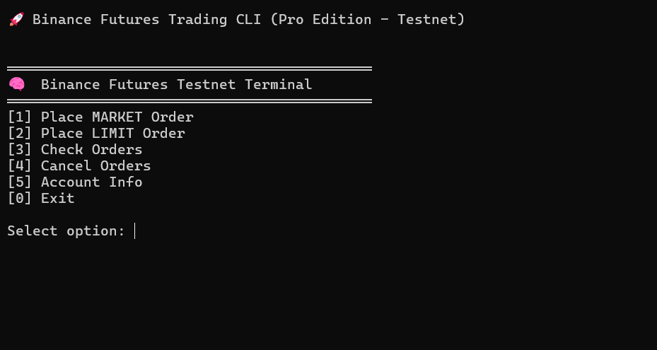
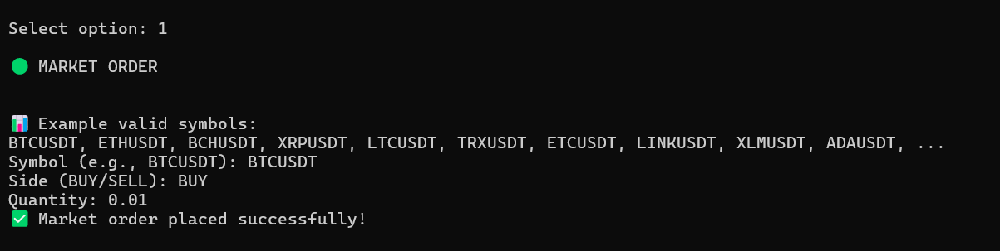
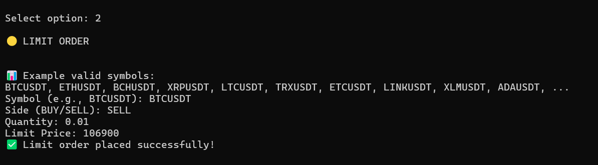
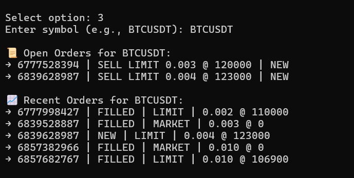
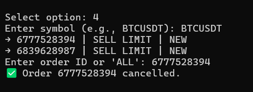
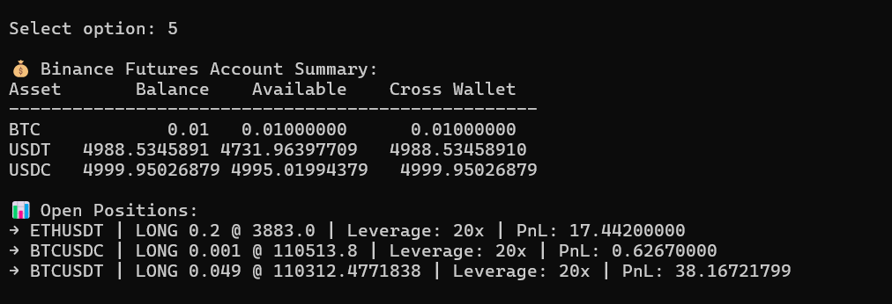
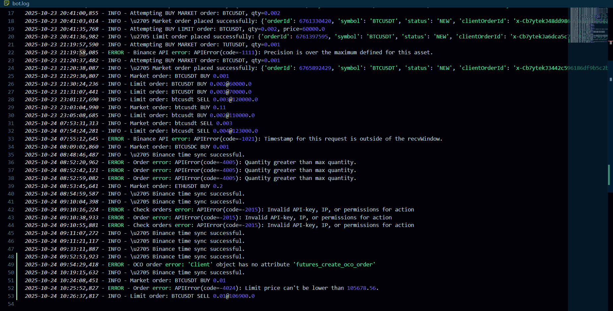

# Binance Futures Order Bot Report

## 1. Introduction

This project implements a CLI-based Binance Futures trading bot in Python.  
The bot supports placing **Market** and **Limit** orders on Binance USDT-M Futures Testnet with input validation, structured logging, and error handling.  
The goal is to provide a reliable, easy-to-use terminal application for automated futures trading.

***

## 2. Features Implemented

- Market order placement with validation and Binance Futures API integration.  
- Limit order placement with price, quantity, and notional checks.  
- Order management: checking open orders and cancelling specific/all orders.  
- Account information display showing balance, open positions, unrealized PnL, and leverage.  
- Centralized configuration for API keys, logging, and time synchronization.  
- Structured logging in `bot.log` for order actions, errors, and diagnostics.  
- Modular code with clear separation between market orders, limit orders, account info, and order management.

***

## 3. Project Structure

```
your_name_binance_bot/
│
├── src/
│   ├── main.py         # CLI menu and user interaction  
│   ├── config.py       # Centralized API client, time sync, logger  
│   ├── market_orders.py  
│   ├── limit_orders.py  
│   ├── check_orders.py  
│   ├── cancel_orders.py  
│   ├── account_info.py  
│   └── advanced/       # (empty or for future advanced orders)  
├── .env                # API keys (not committed)  
├── bot.log             # Logs all actions and errors  
├── README.md  
├── report.pdf          # This report  
├── requirements.txt  
```

***

## 4. Usage Examples (Screenshots)

### CLI Main Menu  


### Sample Market Order Input  


### Sample Limit Order Input  


### Check Orders Screen  


### Cancel Orders Screen  


### Account Info Screen  


***

## 5. Error Handling

- The bot validates all user inputs before sending orders to Binance.  
- Binance API exceptions (e.g., insufficient margin, invalid symbols) are captured and printed clearly.  
- Network or unexpected errors are logged with timestamps in `bot.log` for troubleshooting.  
- Input validation prevents erroneous or too-small orders.



***

## 6. Challenges & Future Enhancements

- **Advanced Order Types:** OCO, Stop-Limit, TWAP, and Grid orders are not yet implemented but planned.  
- **Real-time Updates:** Currently, order status updates require user action; adding WebSocket streaming for live data is a future enhancement.  
- **Interactive Dashboard:** Implementing a colorized CLI dashboard for live PnL and order tracking.  
- **Automated Trading Strategies:** Integrating algorithmic strategies for entry/exit signals based on technical indicators.

***

## 7. Conclusion

This project lays a robust foundation for automated futures trading on Binance Testnet.  
It meets the core assignment requirements with clean code, strong input validation, consistent logging, and a user-friendly CLI.  
With future extensions for advanced order types and real-time features, the bot could evolve into a powerful production system.

***

## 8. References

- Binance Futures API Documentation: https://binance-docs.github.io/apidocs/futures/en/  
- python-binance GitHub: https://github.com/sammchardy/python-binance  
- python-dotenv Documentation: https://pypi.org/project/python-dotenv/